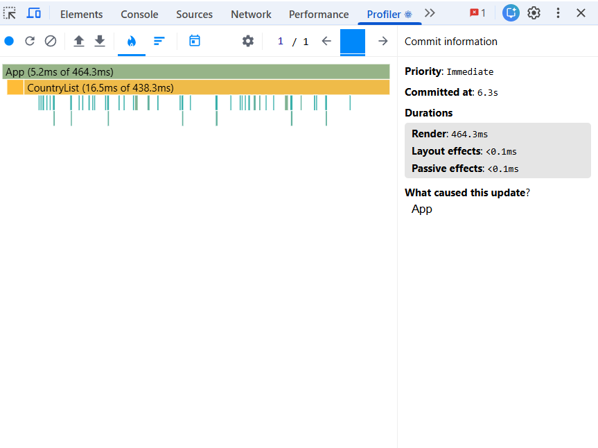
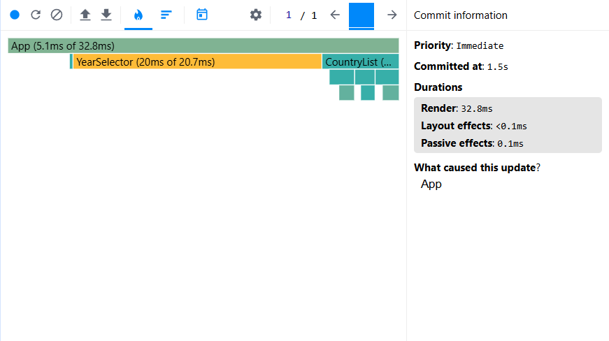
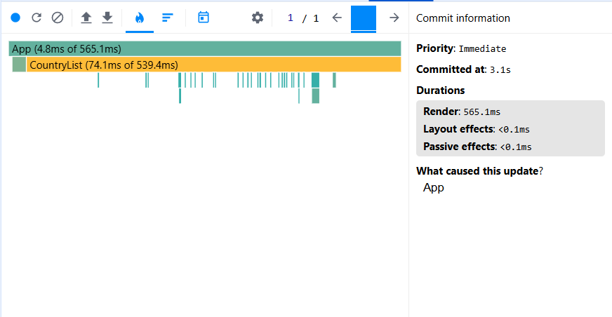
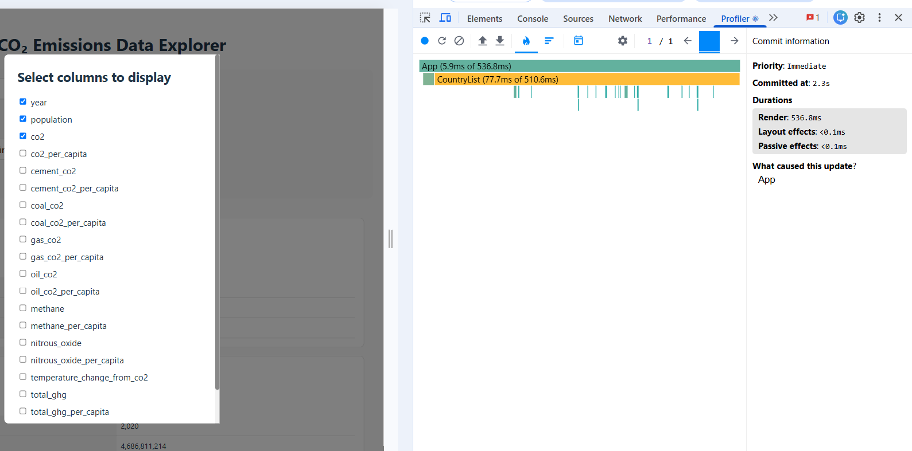

# Performance Optimization Report

CO₂ Emissions Data Explorer

## Testing Environment

All baseline measurements were recorded before applying any performance optimizations using React DevTools Profiler.

---

# Phase 1: Initial Profiling

## 1. Sorting Countries

The sorting option was changed from `Population` to `Name`.

### Results

- Commits: 1
- Committed at: 6.3 s
- Total render duration: 464.3 ms
- App own render time: 5.2 ms
- CountryList subtree duration: 438.3 ms
- CountryList own render time: 16.5 ms

---

## 2. Searching for a Country

### Interaction

The value `United` was pasted into the empty search input as one action.

### Results

- Commits: 1
- Committed at: 1.5 s
- Total render duration: 32.8 ms
- App own render time: 5.1 ms

---

## 3. Selecting a Different Year

### Interaction

The selected year was changed from `2020` to `2019` while the search input was empty.

### Results

- Commits: 1
- Committed at: 3.1 s
- Total render duration: 565.1 ms
- App own render time: 4.8 ms
- CountryList subtree duration: 539.4 ms
- CountryList own render time: 74.1 ms

---

## 4. Toggling a Column

### Interaction

The column selection modal was opened before recording. During profiling, only the `co2_per_capita` checkbox was disabled.

### Results

- Commits: 1
- Committed at: 2.3 s
- Total render duration: 536.8 ms
- App own render time: 5.9 ms
- CountryList subtree duration: 510.6 ms
- CountryList own render time: 77.7 ms

---

# Phase 2: Final Profiling and Comparison
